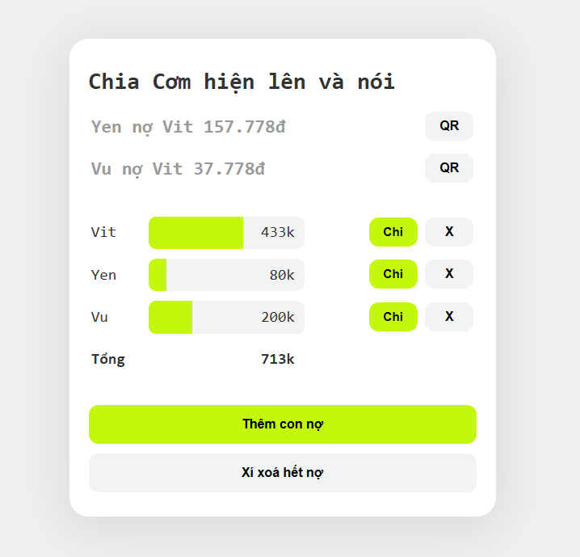

# who-owes-whom (Vietnamese 🇻🇳)
Web Tool for small group of friend to go lunch together and tell you who owes whom. Support Vietnamese QR Banking for quick paying.

Simple HTML/CSS/JavaScript, store data in web's local storage

## Setup
Just upload the files onto public_html/ on file-serving server like Apache or nginx. That's all.
To create QR Code for quick Vietnamese bank transfer, User names must match banks in [app.js](app.js) (first line) 

```javascript
const banks = {
    "vit": {name: "HOANG DUC VIT", bank: "tpbank", number: "0123456789"},
}
```

## How to use

Click [+] button to add a new frend, enter amount of spending, the person should show on the list. Repeat the same thing with others then you should see how much someone is owning each other. 

Data is perserved for next time using. Just don't clear the browser's data for this website.


## Manage total spend and 


 
