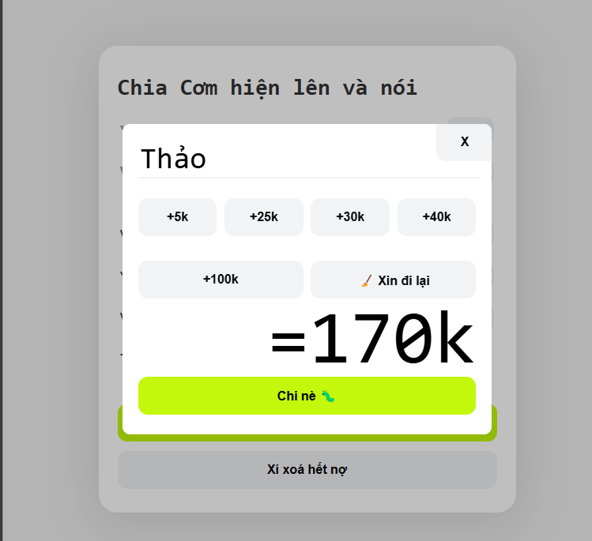

# who-owes-whom (Vietnamese 🇻🇳)
Web Tool to track money spending and tell you who owes whom. Support Vietnamese QR Banking for quick paying.

Simple HTML/CSS/JavaScript, store data in web's local storage

User names must match banks in [app.js](app.js) (first line) to create QR Code for quick Vietnamese bank transfer

```javascript
const banks = {
    "vit": {name: "HOANG DUC VIT", bank: "tpbank", number: "0123456789"},
}
```

## Manage total spend and 


 
